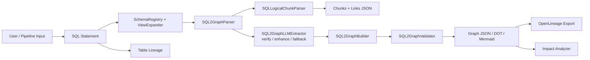
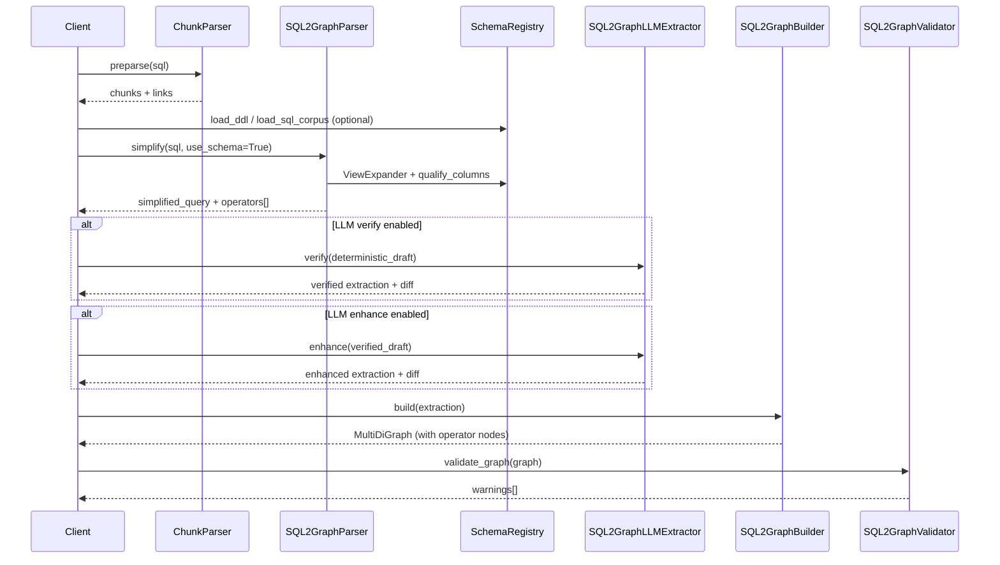

# llm4lineage

`llm4lineage` is an LLM-assisted lineage toolkit for GreenPlum/PostgreSQL-style DWH SQL. It turns SQL and schema context into structured lineage artifacts: table-level dependencies, column-level graphs, logical SQL chunks, and optional OpenLineage export.

**Implementation guide:** [`Specifications/llm4lineage_SPEC.md`](Specifications/llm4lineage_SPEC.md) (phased roadmap, data contracts, acceptance criteria).

It currently supports four tracks:
- **SQL pipeline** (`Classes.pipeline`) — deterministic sqlglot parse → AST JSON → column lineage → LLM analysis (see [`Specifications/ADDITIONALS.md`](Specifications/ADDITIONALS.md))
- **Table-level lineage** — `target` + `sources` (LLM or deterministic via `Classes/table_lineage.py`)
- **Column-level lineage graph** (`SQL2Graph`) — five-step pipeline with optional LLM verify/enhance
- **SQL logical chunk decomposition** (`SQLLogicalChunkParser`, deterministic sqlglot only)

The project combines `LangChain` + `Hugging Face` inference with deterministic parsing, graph construction, and validation.

---

## Why This Project

Most real SQL lineage tasks break in one of three places:
- extraction misses implicit dependencies
- output is unstructured or inconsistent across SQL styles
- downstream SQL generation lacks hidden domain knowledge

`llm4lineage` addresses these with:
- strict Pydantic models for normalized outputs
- deterministic `sqlglot` parsing and `sqlglot.lineage` column resolution
- graph-native lineage representation for visualization and downstream tooling

---

## Architecture Overview



---

## Main Modules

### 0) SQL Pipeline (ADDITIONALS.md)

Implements the **AI-Driven SQL Parsing Pipeline** from [`Specifications/ADDITIONALS.md`](Specifications/ADDITIONALS.md) (v2.1), integrated into `Classes.pipeline` and shared across all modules.

Primary classes:
- `SQLParser` — parse SQL to sqlglot AST
- `ASTSerializer` — stack-based AST → JSON (configurable `max_depth`)
- `ColumnLineageExtractor` — per-column source→target lineage
- `LLMFactory` / `create_chat_model` — unified provider routing (HF inference, OpenAI, Anthropic, Ollama, mock)
- `SQLAnalysisChain` — LangChain prompt + retry
- `PipelineOrchestrator` — end-to-end coordinator with graceful degradation
- `PipelineResult` — structured result with `success` flag

`SQL2GraphParser.simplify()` now embeds `column_lineage` and `ast_summary` from the shared pipeline components.

Quick start:

```python
from Classes import Config, PipelineOrchestrator, setup_logging

setup_logging("INFO")
config = Config(llm_provider="mock")  # or huggingface_inference, openai, ollama, …
orchestrator = PipelineOrchestrator(config)

result = orchestrator.run(
    "SELECT u.name, SUM(o.amount) AS total "
    "FROM users u JOIN orders o ON u.id = o.user_id "
    "GROUP BY u.name",
    instruction="Explain the query in simple terms.",
)

if result.success:
    print(result.column_lineage)
    print(result.llm_response)
```

CLI:

```bash
python -m Classes.pipeline.main --sql "SELECT 1 AS one" --provider mock --instruction "What does this do?"
# or: sql-pipeline --sql "SELECT 1 AS one" --provider mock
```

Copy `.env.example` to `.env` to configure providers and credentials.

### 1) Table-Level Lineage

Primary class:
- `Classes/model_classes.py` -> `SQLLineageExtractor`

Responsibility:
- parse one SQL statement into a compact table-level lineage object

Typical output:
- `target`: destination table/view
- `sources`: distinct base tables/views

Supporting modules:
- `Classes/validation_classes.py` for validation/metrics
- `Web/app.py` — Streamlit **Lineage Explorer** (upload/paste SQL → table or column lineage)

### 2) SQL2Graph (Column-Level Lineage)

Implements a **column-level v2 profile** of `Specifications/SQL2Graph_spec.md` (v2.1).
Beyond classic `DERIVED_FROM` / `FILTERED_BY` / `JOINS_ON` edges, the graph now includes
operator nodes (`union`, `aggregate`, `window`, `transformation`, `rowset`) and row-flow edges
(`ROW_FLOW_IN`, `ROW_FLOW_OUT`, `VALUE_FLOW`, `AGGREGATES_ON`, `WINDOW_OVER`). Every edge carries
`confidence` and `provenance` metadata.

Primary classes:
- `SQL2GraphParser` — sqlglot simplify + deterministic extraction + `operators[]` metadata
- `SQL2GraphLLMExtractor` — optional verify / enhance / cold-start parse fallback
- `SQL2GraphBuilder` — builds `networkx.MultiDiGraph` with operator nodes
- `SQL2GraphValidator` — graph integrity + allowed node/edge types
- `SQL2GraphPipeline` — five-step end-to-end coordinator

Schema-aware parsing (Phase 1):
- `SchemaRegistry` — load DDL/CSV, qualify `SELECT *`, infer columns from SQL corpus
- `ViewExpander` — inline `CREATE VIEW` bodies before column qualification

Supporting modules:
- `Classes/impact_analyzer.py` — upstream/downstream impact with edge-type reasons
- `Classes/openlineage_exporter.py` — design-time OpenLineage JSON export
- `Classes/table_lineage.py` — deterministic INSERT/MERGE/UPDATE/CTAS table lineage (CTE names excluded from physical sources)
- `Classes/llm_cache.py` — SQLite cache for LLM extraction and full pipeline results (`quality_score`, replace-if-better)
- `Classes/sql_statement_aggregator.py` — batch statement lineage resolution

Five-step pipeline (`SQL2GraphPipeline.run()`):

| Step | Name | Description |
|------|------|-------------|
| 1 | **chunking** | Split SQL into CTEs, UNION branches, INSERT target |
| 2 | **parsing** | sqlglot deterministic column extraction |
| 3 | **verifying** | Optional LLM review of sqlglot draft |
| 4 | **enhancing** | Optional LLM targeted repairs |
| 5 | **combining** | Build graph, link CTE aliases, validate DAG |

Flags: `use_llm_verify`, `use_llm_enhance`, `step_callback` (live progress for UIs).
When sqlglot cannot parse and verify is enabled, the pipeline falls back to LLM cold-start extraction (`pipeline_stage: llm_parse_fallback`).

### 3) SQL Logical Chunk Parser

Primary classes:
- `Classes/sql_chunk_classes.py` -> `SQLLogicalChunkParser`, `SQLLogicalChunkPreParser`

Responsibilities:
- decompose complicated SQL into a small set of logical chunks (CTE bodies, main query / UNION branches, optional INSERT target)
- return connected JSON with `chunks` and `links` only
- derive JOIN / UNION / INSERT links with normalized join conditions (e.g. `customers.id = recent_orders.customer_id`)

Example notebook:
- `examples/column_lineage_end_to_end.ipynb`

Sample result:
- `data/sql_chunk_result.json`

---

## CI & Evaluation

- GitHub Actions runs `pytest tests/ -q` and `ruff check .` on Python 3.9–3.12
- Golden regression: `tests/golden/ddls10_first_graph.json` (edge-F1 ≥ 0.9 on deterministic graph)
- Regenerate golden: `python tests/golden/update_golden.py`

## Supported / Not Supported (SQL2Graph parser)

**Supported (deterministic, postgres/greenplum dialect):**
- `INSERT … SELECT`, CTAS, CTEs, `UNION ALL`
- Column-level lineage with filters, joins, group-by
- `SELECT *` expansion when schema DDL is provided
- View expansion when `CREATE VIEW` is in schema registry
- Operator graph nodes: `union`, `aggregate`, `window`, `transformation`, `rowset`

**Limitations (see `metadata.limitations` in graph JSON):**
- UDF: lineage on input columns only
- Table-valued UDFs: not supported
- `json_extract`, `UNNEST`: best-effort
- Structs: best-effort
- Multi-statement SQL: web UI supports **Target table** selection; CLI still uses first statement by default

**Optional LLM stages:** verify, enhance, parse fallback (when sqlglot fails)

---

## Data Contracts (Schemas)

### A) Table-Level Lineage Contract

```json
{
  "type": "object",
  "required": ["target", "sources"],
  "properties": {
    "target": { "type": "string" },
    "sources": {
      "type": "array",
      "items": { "type": "string" }
    }
  }
}
```

Example:

```json
{
  "target": "analytics.sales_summary",
  "sources": ["products.raw_data", "sales.transactions"]
}
```

### B) SQL2Graph Extraction Contract (Simplified)

```json
{
  "type": "object",
  "required": ["ctes", "output_columns", "filters", "joins", "group_by_columns"],
  "properties": {
    "ctes": { "type": "array" },
    "output_columns": {
      "type": "array",
      "items": {
        "type": "object",
        "required": ["alias", "expression", "dependencies", "aggregate", "window_function"]
      }
    },
    "filters": { "type": "array" },
    "joins": { "type": "array" },
    "group_by_columns": { "type": "array" }
  }
}
```

Key entity shapes used in code:
- `ColumnRef`: `table_alias`, `column`
- `OutputColumn`: alias/expression/dependencies + aggregate/window flags
- `FilterSpec`: clause/condition/columns_used
- `JoinSpec`: type/aliases/condition/join_columns(2)

### C) Graph JSON Contract (Node-Link)

Produced by `SQL2GraphPipeline.run()` (includes `metadata` per spec v2.1 §5):

```json
{
  "nodes": [
    { "id": "output.total", "node_type": "output_column" },
    { "id": "orders.amount", "node_type": "source_column" }
  ],
  "links": [
    { "source": "orders.amount", "target": "output.total", "edge_type": "DERIVED_FROM" }
  ],
  "metadata": {
    "source_sql_hash": "...",
    "generated_at": "...",
    "spec_version": "2.1",
    "implementation_profile": "column_level_v2",
    "limitations": ["udf_inputs_only", "unnest_best_effort", "structs_best_effort", "multi_statement_sql"]
  }
}
```

Edge metadata (v2):

```json
{
  "source": "orders.amount",
  "target": "output.total",
  "edge_type": "DERIVED_FROM",
  "confidence": 1.0,
  "provenance": "deterministic"
}
```

`provenance` values: `deterministic`, `llm`, `llm_verified`.

### D) SQL Logical Chunk Contract

Produced by `SQLLogicalChunkParser.preparse()` / `.parse()`:

```json
{
  "type": "object",
  "required": ["chunks", "links"],
  "properties": {
    "chunks": {
      "type": "array",
      "items": {
        "type": "object",
        "required": ["id", "name", "chunk_type", "sql"],
        "properties": {
          "chunk_type": { "enum": ["cte", "query", "target"] }
        }
      }
    },
    "links": {
      "type": "array",
      "items": {
        "type": "object",
        "required": ["source", "target", "link_type", "condition"],
        "properties": {
          "link_type": { "enum": ["JOIN", "UNION", "UNION ALL", "UNION DISTINCT", "INSERT", "INTERSECT", "EXCEPT"] }
        }
      }
    }
  }
}
```

Chunk types:
- `cte`: body of a `WITH` clause
- `query`: outer query or UNION branch
- `target`: INSERT / CTAS destination table

---

## SQL2Graph Processing Flow



Internal graph semantics (column-level v2):
- `DERIVED_FROM`: source column → output column (column value lineage)
- `FILTERED_BY` / `USES_COLUMN`: filter gating and column references
- `JOINS_ON`: join key relationship
- `GROUPED_BY`: group-by column → aggregate output
- `ROW_FLOW_IN` / `ROW_FLOW_OUT`: UNION / CTE rowset flow
- `VALUE_FLOW` / `AGGREGATES_ON` / `WINDOW_OVER`: expression, aggregate, window operators

Graphs are enforced as DAGs via `SQL2GraphBuilder.ensure_acyclic()`.
Deterministic sqlglot column lineage is preserved via `overlay_deterministic_column_lineage()` after LLM steps.

---

## Repository Structure

```text
Classes/
  pipeline/           # ADDITIONALS.md core: parser, serializer, lineage, LLM factory, orchestrator
  schema_registry.py  # DDL/CSV schema catalog + qualify_columns
  view_expander.py    # CREATE VIEW inlining before qualification
  table_lineage.py    # deterministic INSERT/MERGE/UPDATE table lineage
  impact_analyzer.py  # upstream/downstream impact API
  openlineage_exporter.py
  llm_cache.py        # SQLite LLM response cache
  sql_statement_aggregator.py
  sql2graph_classes.py
  sql_chunk_classes.py
  graph_drawer.py
  model_classes.py
  validation_classes.py
.github/workflows/ci.yml
examples/
  column_lineage_end_to_end.ipynb
  ddls10_parsing_lineage_test.ipynb
Specifications/
  SQL2Graph_spec.md
  llm4lineage_SPEC.md   # phased implementation guide
  ADDITIONALS.md        # shared sqlglot pipeline architecture (v2.1)
Web/
  app.py                # Lineage Explorer (Streamlit)
tests/
  golden/               # edge-F1 regression fixtures
  test_schema_registry.py
  test_view_expander.py
  test_phase1_integration.py
  test_openlineage_exporter.py
  test_impact_analyzer.py
  test_llm_cache.py
  …
data/
  DDLs_10.txt           # sample GreenPlum INSERT corpus
  DDLs.txt
  SQL.txt
```

---

## Installation

### 1) Create environment

```bash
uv venv
source .venv/bin/activate
```

### 2) Install project (choose extras)

| Extra | Purpose |
|-------|---------|
| *(core only)* | sqlglot parsing, graph build, schema registry — no LLM/UI |
| `[llm]` | LangChain + HuggingFace for LLM verify/enhance |
| `[web]` | Streamlit, graphviz, plotly, matplotlib |
| `[dev]` | pytest, ruff |
| `[all]` | everything |

```bash
# Full development install (recommended)
uv pip install -e ".[llm,web,dev]"

# Minimal / CI library use
uv pip install -e ".[core]"
```

Default SQL dialect is **postgres** (GreenPlum-compatible). Override per call with `dialect="postgres"`.

### 3) Configure Hugging Face token

```bash
export HF_TOKEN=your_token_here
```

Optional `.env`:

```env
HF_TOKEN=your_token_here
MODEL_NAME=Qwen/Qwen3-Coder-30B-A3B-Instruct
PROVIDER=scaleway
```

`MODEL_NAME` and `PROVIDER` set the default model and inference provider for all
extractors/generators; explicit `model=` / `provider=` arguments always take precedence.

### 4) Run the example notebook

```bash
jupyter lab examples/column_lineage_end_to_end.ipynb
```

---

## Quick Start

### A) Table-Level Lineage

```python
import os
from Classes.model_classes import SQLLineageExtractor

extractor = SQLLineageExtractor(
    model="Qwen/Qwen3-Coder-30B-A3B-Instruct",
    provider="scaleway",
    hf_token=os.environ["HF_TOKEN"],
)

sql = """
INSERT INTO analytics.sales_summary
SELECT p.category, SUM(s.amount)
FROM products.raw_data p
JOIN sales.transactions s ON p.product_id = s.product_id
GROUP BY p.category
"""

result = extractor.extract(sql)
print(result)
```

### B) SQL2Graph Pipeline

```python
import os
from Classes.sql2graph_classes import SQL2GraphLLMExtractor, SQL2GraphParser, SQL2GraphPipeline
from Classes.schema_registry import SchemaRegistry

# Optional: load schema for SELECT * / view expansion
registry = SchemaRegistry(dialect="postgres").load_ddl("""
    CREATE TABLE public.orders (customer_id INT, amount NUMERIC);
""")

parser = SQL2GraphParser(dialect="postgres", schema_registry=registry)
llm = SQL2GraphLLMExtractor(hf_token=os.environ["HF_TOKEN"])
pipeline = SQL2GraphPipeline(llm_extractor=llm, parser=parser)

sql = open("data/DDLs_10.txt").read().split(";")[0]

out = pipeline.run(
    sql=sql,
    dialect="postgres",
    use_llm_verify=True,   # LLM reviews sqlglot draft
    use_llm_enhance=True,  # LLM applies targeted fixes
)
print(out["pipeline_stage"])       # deterministic | llm_verified | llm_enhanced
print(out["verification_diff"])    # what LLM changed during verify
print(out["enhancement_diff"])       # what LLM changed during enhance
print(len(out["graph"]["nodes"]))  # graph node count
```

Deterministic-only (no LLM):

```python
from Classes.sql2graph_classes import SQL2GraphParser, SQL2GraphPipeline

pipeline = SQL2GraphPipeline(parser=SQL2GraphParser(dialect="postgres"))
out = pipeline.run(sql, dialect="postgres", use_llm_verify=False, use_llm_enhance=False)
```

### B2) Table-Level Lineage (deterministic)

```python
from Classes.table_lineage import extract_table_lineage

result = extract_table_lineage(
    "MERGE INTO schema.tgt t USING schema.src s ON t.id = s.id "
    "WHEN MATCHED THEN UPDATE SET x = 1",
    dialect="postgres",
)
print(result["target"], result["sources"])
```

### B3) OpenLineage export

```bash
llm4lineage-openlineage --sql data/DDLs_10.txt --format run --dialect postgres
llm4lineage-openlineage --sql query.sql --format job --out lineage.json
```

### B4) Impact analysis

```bash
llm4lineage-impact --sql data/DDLs_10.txt --target output.attr_name --direction both
```

### C) SQL Logical Chunk Parser

```python
import os
from Classes.sql_chunk_classes import SQLLogicalChunkParser

parser = SQLLogicalChunkParser()

sql = """
WITH recent_orders AS (
    SELECT customer_id, SUM(amount) AS total
    FROM orders
    WHERE order_date > '2025-01-01'
    GROUP BY customer_id
)
SELECT c.name, r.total
FROM customers c
JOIN recent_orders r ON c.id = r.customer_id
WHERE c.active = true
"""

out = parser.preparse(sql)

print(out["chunks"])
print(out["links"])
```

---

## Streamlit App

Run:

```bash
uv pip install -e ".[web,llm]"
streamlit run Web/app.py
```

### Sidebar

| Control | Purpose |
|---------|---------|
| **Hugging Face token** | Required for LLM verify/enhance |
| **HuggingFace model** | Preset or custom repo ID (e.g. Qwen3-Coder) |
| **Inference provider** | HF Inference Providers backend (Scaleway, Together, …) |
| **Model connection test** | Auto-runs for presets; manual button for custom model/provider |
| **SQL dialect** | `postgres` (default), spark, teradata, hive |
| **Schema DDL** | Optional `CREATE TABLE` / `CREATE VIEW` for `SELECT *` and view expansion |
| **LLM verify / enhance** | Independent toggles for pipeline steps 3–4 |
| **Use LLM cache** | Read/write SQLite cache (`~/.cache/llm4lineage/llm_cache.sqlite`) |
| **Replace cache if better** | Keep cached result unless fresh run scores higher (`quality_score`) |

### SQL input

1. **Upload file** tab — drag/drop `.sql` or `.txt`, or load sample buttons (`DDLs_10.txt`, first statement only).
2. **Paste SQL** tab — free-form editor synced with upload content.
3. **Target table** — when the script has multiple statements, pick which `INSERT`/`MERGE`/… to analyze.
4. **Clear** — resets SQL, results, and editor state.

### Analysis & results

1. Click **Analyze lineage** — live five-step progress (`chunking → parsing → verifying → enhancing → combining`).
2. **Lineage level** radio:
   - **Table** — target table + source tables graph; click a source to highlight and see linked output columns.
   - **Column** — per-output-column buttons; click for expression, dependencies, UNION branches, and column graph.
3. Compact pipeline summary (stage, target, column count) plus cache hit/update/bypass status.
4. **Edge F1** metrics (column level only) when SQL matches a golden fixture (`tests/golden/`).
5. **LLM changes** expander — verification/enhancement diffs when LLM steps ran.

Test with the first statement from `data/DDLs_10.txt` (GreenPlum INSERT with UNION ALL CTEs).

---

## Testing

```bash
uv pip install -e ".[llm,web,dev]"
python -m pytest tests/ tests/golden/ -q
ruff check .
```

Golden regression (edge-F1 ≥ 0.9 on `DDLs_10` first query):

```bash
python tests/golden/update_golden.py   # regenerate after intentional graph changes
python -m pytest tests/golden/ -q
```

Run focused suites:

```bash
python -m pytest tests/test_sql2graph_classes.py -q
python -m pytest tests/test_schema_registry.py tests/test_view_expander.py -q
python -m pytest tests/test_openlineage_exporter.py tests/test_impact_analyzer.py -q
```

---

## Troubleshooting

| Issue | What to check |
|---|---|
| `401` / forbidden from HF | token validity, model access, selected provider |
| `ImportError: SchemaRegistry` | restart Streamlit after `git pull`; use `pip install -e ".[web,llm]"` |
| `ModuleNotFoundError: langchain_huggingface` | `uv pip install -e ".[llm]"` |
| SQL2Graph `parser_used: false` | set dialect to `postgres`; enable LLM verify for parse fallback |
| Empty lineage for `SELECT *` | paste `CREATE TABLE` DDL in sidebar Schema DDL field |
| `attr_name` shows literals not tables | expected — column is hardcoded via UNION ALL branches |
| LLM enhance "model busy" / 503 | transient HF errors are retried; disable enhance or use cache |
| Streamlit `sql_paste_area` error on Clear | fixed via widget key rotation — restart Streamlit after `git pull` |
| Streamlit deprecation warnings | upgrade Streamlit; app uses `width="stretch"` |

---

## Roadmap

Implemented (see [`Specifications/llm4lineage_SPEC.md`](Specifications/llm4lineage_SPEC.md)):

- [x] Phase 0 — core extras, CI, ruff, sqlglot pin
- [x] Phase 1 — postgres default, SchemaRegistry, ViewExpander, LLM parse fallback
- [x] Phase 2 — union/aggregate/window/rowset operator nodes
- [x] Phase 3 — edge confidence/provenance, golden set, edge-F1, LLM cache
- [x] Phase 4 — OpenLineage design-time export
- [x] Phase 5 — impact analyzer CLI
- [x] Phase 6 — MERGE/UPDATE table lineage, README supported/not-supported

Remaining:

- full expression IR trees and SqlStatementAggregator across production SQL batches
- LLM schema auto-recovery (DBAutoDoc-style)
- SQL equivalence checking after normalization
- unified single API across all four tracks

---

## References

- [`Specifications/llm4lineage_SPEC.md`](Specifications/llm4lineage_SPEC.md) — phased implementation guide (Phases 0–6)
- [`Specifications/SQL2Graph_spec.md`](Specifications/SQL2Graph_spec.md) — full SQL2Graph v2.1 specification
- [`Specifications/ADDITIONALS.md`](Specifications/ADDITIONALS.md) — shared sqlglot pipeline architecture
