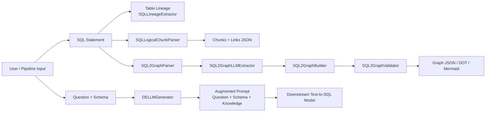
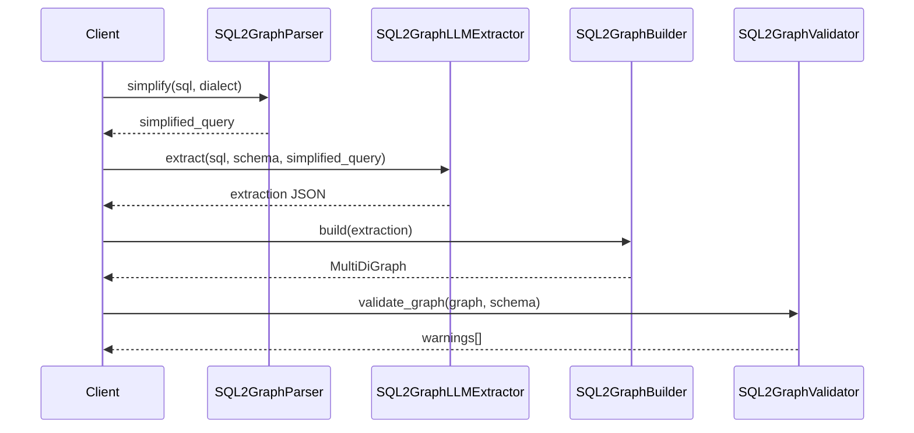
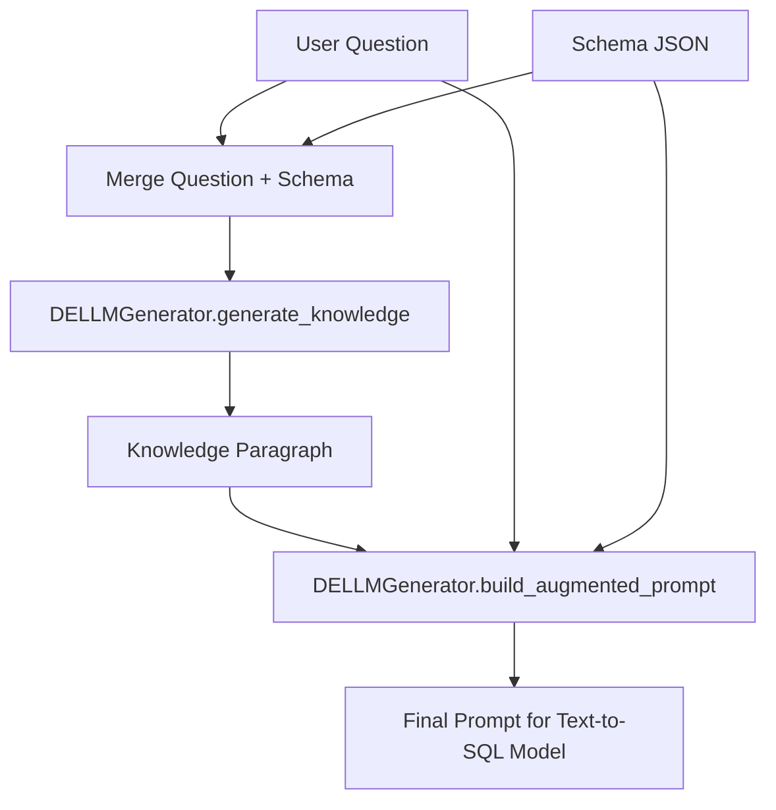

# llm4lineage

`llm4lineage` is an LLM-assisted lineage toolkit focused on turning SQL and schema context into usable lineage artifacts.

It currently supports five tracks:
- table-level lineage extraction (`target` + `sources`)
- column-level lineage graph extraction (`SQL2Graph`)
- SQL logical chunk decomposition (`SQLLogicalChunkParser`)
- DELLM knowledge generation (expert context for text-to-SQL prompts)
- view structure extraction from view definitions (`ViewsStructureExtractor`)

The project combines `LangChain` + `Hugging Face` inference with deterministic parsing, graph construction, and validation.

---

## Why This Project

Most real SQL lineage tasks break in one of three places:
- extraction misses implicit dependencies
- output is unstructured or inconsistent across SQL styles
- downstream SQL generation lacks hidden domain knowledge

`llm4lineage` addresses these with:
- strict Pydantic models for normalized outputs
- deterministic checks around LLM output
- graph-native lineage representation for visualization and downstream tooling
- DELLM augmentation for semantic gaps (arithmetic, terminology, formatting)

---

## Architecture Overview



---

## Main Modules

### 1) Table-Level Lineage

Primary class:
- `Classes/model_classes.py` -> `SQLLineageExtractor`

Responsibility:
- parse one SQL statement into a compact table-level lineage object

Typical output:
- `target`: destination table/view
- `sources`: distinct base tables/views

Supporting modules:
- `Classes/validation_classes.py` for validation/metrics
- `Classes/prompt_refiner.py` for reflexion loop and prompt optimization
- `Web/app.py` for single-query and batch UI

### 2) SQL2Graph (Column-Level Lineage)

Implements a **simplified column-level profile** of `SQL2Graph_spec.md` (v2.1).
The spec defines a full transformation graph (RowSets, operator nodes, expression IR);
this repo currently ships value/filter/join lineage via `DERIVED_FROM`, `FILTERED_BY`,
`USES_COLUMN`, `JOINS_ON`, and `GROUPED_BY` edges. See the spec's *Implementation
Status* section for the full mapping and roadmap.

Primary classes:
- `SQL2GraphParser`
- `SQL2GraphLLMExtractor`
- `SQL2GraphBuilder`
- `SQL2GraphValidator`
- `SQL2GraphPipeline`

Responsibilities:
- extract structured column dependencies and predicates
- build typed lineage graph (`networkx.MultiDiGraph`)
- return serializable node-link JSON plus optional DOT/Mermaid

### 3) SQL Logical Chunk Parser

Primary classes:
- `Classes/sql_chunk_classes.py` -> `SQLLogicalChunkParser`, `SQLLogicalChunkPreParser`

Responsibilities:
- decompose complicated SQL into a small set of logical chunks (CTE bodies, main query / UNION branches, optional INSERT target)
- return connected JSON with `chunks` and `links` only
- derive JOIN / UNION / INSERT links with normalized join conditions (e.g. `customers.id = recent_orders.customer_id`)
- optionally refine deterministic output with an LLM pass (`use_llm=True`)

Typical output:

```json
{
  "chunks": [
    {
      "id": "recent_orders",
      "name": "recent_orders",
      "chunk_type": "cte",
      "sql": "SELECT customer_id, SUM(amount) AS total FROM orders ..."
    },
    {
      "id": "main",
      "name": "main",
      "chunk_type": "query",
      "sql": "SELECT c.name, r.total FROM customers c JOIN recent_orders r ..."
    }
  ],
  "links": [
    {
      "source": "main",
      "target": "recent_orders",
      "link_type": "JOIN",
      "condition": "customers.id = recent_orders.customer_id"
    }
  ]
}
```

Notebook:
- `SQLChunkParser.ipynb`

Sample result:
- `data/sql_chunk_result.json`

### 4) DELLM (Data Expert LLM)

Primary class:
- `Classes/dellm_classes.py` -> `DELLMGenerator`

Responsibilities:
- generate short expert knowledge from `question + schema`
- constrain output to compact, task-relevant context
- produce final augmented prompt for downstream SQL generation

Notebook:
- `DELLM_test.ipynb`

### 5) Views Structure Extraction

Primary class:
- `Classes/views_structure_classes.py` -> `ViewsStructureExtractor`

Responsibilities:
- reverse-engineer view definitions from a CSV (`table_name`, `view_def` columns)
- extract source tables, output columns, joins, filters, and CTEs per view
- qualify `alias.column` references to `schema.table.column` where inferable
- fall back to deterministic regex extraction when LLM output is invalid

Notebook:
- `ViewsStructure.ipynb`

---

## Data Contracts (Schemas)

### A) Table-Level Lineage Contract

```json
{
  "type": "object",
  "required": ["target", "sources"],
  "properties": {
    "target": { "type": "string" },
    "sources": {
      "type": "array",
      "items": { "type": "string" }
    }
  }
}
```

Example:

```json
{
  "target": "analytics.sales_summary",
  "sources": ["products.raw_data", "sales.transactions"]
}
```

### B) SQL2Graph Extraction Contract (Simplified)

```json
{
  "type": "object",
  "required": ["ctes", "output_columns", "filters", "joins", "group_by_columns"],
  "properties": {
    "ctes": { "type": "array" },
    "output_columns": {
      "type": "array",
      "items": {
        "type": "object",
        "required": ["alias", "expression", "dependencies", "aggregate", "window_function"]
      }
    },
    "filters": { "type": "array" },
    "joins": { "type": "array" },
    "group_by_columns": { "type": "array" }
  }
}
```

Key entity shapes used in code:
- `ColumnRef`: `table_alias`, `column`
- `OutputColumn`: alias/expression/dependencies + aggregate/window flags
- `FilterSpec`: clause/condition/columns_used
- `JoinSpec`: type/aliases/condition/join_columns(2)

### C) Graph JSON Contract (Node-Link)

Produced by `SQL2GraphPipeline.run()` (includes `metadata` per spec v2.1 §5):

```json
{
  "nodes": [
    { "id": "output.total", "node_type": "output_column" },
    { "id": "orders.amount", "node_type": "source_column" }
  ],
  "links": [
    { "source": "orders.amount", "target": "output.total", "edge_type": "DERIVED_FROM" }
  ],
  "metadata": {
    "source_sql_hash": "...",
    "generated_at": "...",
    "spec_version": "2.1",
    "implementation_profile": "column_level_v1"
  }
}
```

### D) DELLM Output Contract

```json
{
  "type": "object",
  "required": ["knowledge", "categories"],
  "properties": {
    "knowledge": { "type": "string" },
    "categories": {
      "type": "array",
      "items": { "type": "string" }
    }
  }
}
```

Typical categories:
- `arithmetic_reasoning`
- `domain_terminology`
- `formatting_synonyms`

### E) SQL Logical Chunk Contract

Produced by `SQLLogicalChunkParser.preparse()` / `.parse()`:

```json
{
  "type": "object",
  "required": ["chunks", "links"],
  "properties": {
    "chunks": {
      "type": "array",
      "items": {
        "type": "object",
        "required": ["id", "name", "chunk_type", "sql"],
        "properties": {
          "chunk_type": { "enum": ["cte", "query", "target"] }
        }
      }
    },
    "links": {
      "type": "array",
      "items": {
        "type": "object",
        "required": ["source", "target", "link_type", "condition"],
        "properties": {
          "link_type": { "enum": ["JOIN", "UNION", "UNION ALL", "UNION DISTINCT", "INSERT", "INTERSECT", "EXCEPT"] }
        }
      }
    }
  }
}
```

Chunk types:
- `cte`: body of a `WITH` clause
- `query`: outer query or UNION branch
- `target`: INSERT / CTAS destination table

---

## SQL2Graph Processing Flow



Internal graph semantics (column-level profile; see `SQL2Graph_spec.md` v2.1 for target model):
- `DERIVED_FROM`: source column contributes to output column (maps to `VALUE_FLOW`)
- `FILTERED_BY`: filter condition gates output rows
- `USES_COLUMN`: source column referenced by filter (maps to `FILTER_CONDITION`)
- `JOINS_ON`: left join key column relates to right join key column (maps to `JOIN_KEY`, unidirectional)
- `GROUPED_BY`: grouping column defines aggregate output grain (maps to `GROUPING_KEY`)

Graphs are enforced as DAGs: edge directions flow from sources/filters toward outputs, and
`SQL2GraphBuilder.ensure_acyclic()` removes any remaining cyclic edges after construction.

---

## DELLM Inference Flow



Design goals:
- keep generated knowledge concise and high-signal
- avoid SQL generation in DELLM layer
- improve downstream SQL accuracy on implicit business logic

---

## Repository Structure

```text
Classes/
  __init__.py
  helper_classes.py
  model_classes.py
  validation_classes.py
  prompt_refiner.py
  refine_classes.py
  regexp_extractor.py
  sql2graph_classes.py
  sql_chunk_classes.py
  dellm_classes.py
  views_structure_classes.py
  graph_drawer.py
Web/
  app.py
tests/
  test_helper_classes.py
  test_model_classes.py
  test_validation_classes.py
  test_regexp_extractor.py
  test_sql2graph_classes.py
  test_sql_chunk_classes.py
  test_dellm_classes.py
  test_views_structure_classes.py
Extractor.ipynb
Refiner.ipynb
RegexpExtractor.ipynb
Scores.ipynb
Validation.ipynb
SQL2Graph.ipynb
SQLChunkParser.ipynb
DELLM_test.ipynb
ViewsStructure.ipynb
SQL2Graph_spec.md
DELLM.md
```

---

## Installation

### 1) Create environment

```bash
uv venv
source .venv/bin/activate
```

### 2) Install project

```bash
uv pip install -e .
```

### 3) Configure Hugging Face token

```bash
export HF_TOKEN=your_token_here
```

Optional `.env`:

```env
HF_TOKEN=your_token_here
MODEL_NAME=Qwen/Qwen3-Coder-30B-A3B-Instruct
PROVIDER=scaleway
```

`MODEL_NAME` and `PROVIDER` set the default model and inference provider for all
extractors/generators; explicit `model=` / `provider=` arguments always take precedence.

---

## Quick Start

### A) Table-Level Lineage

```python
import os
from Classes.model_classes import SQLLineageExtractor

extractor = SQLLineageExtractor(
    model="Qwen/Qwen3-Coder-30B-A3B-Instruct",
    provider="scaleway",
    hf_token=os.environ["HF_TOKEN"],
)

sql = """
INSERT INTO analytics.sales_summary
SELECT p.category, SUM(s.amount)
FROM products.raw_data p
JOIN sales.transactions s ON p.product_id = s.product_id
GROUP BY p.category
"""

result = extractor.extract(sql)
print(result)
```

### B) SQL2Graph Pipeline

```python
import os
from Classes.sql2graph_classes import SQL2GraphLLMExtractor, SQL2GraphPipeline

llm = SQL2GraphLLMExtractor(hf_token=os.environ["HF_TOKEN"])
pipeline = SQL2GraphPipeline(llm_extractor=llm)

sql = """
WITH r AS (
  SELECT customer_id, SUM(amount) AS total
  FROM orders
  GROUP BY customer_id
)
SELECT c.name, r.total
FROM customers c
JOIN r ON c.id = r.customer_id
"""

out = pipeline.run(sql=sql, schema=None, include_visualization=True)
print(out.keys())
```

### C) SQL Logical Chunk Parser

```python
import os
from Classes.sql_chunk_classes import SQLLogicalChunkParser

parser = SQLLogicalChunkParser(hf_token=os.environ["HF_TOKEN"])

sql = """
WITH recent_orders AS (
    SELECT customer_id, SUM(amount) AS total
    FROM orders
    WHERE order_date > '2025-01-01'
    GROUP BY customer_id
)
SELECT c.name, r.total
FROM customers c
JOIN recent_orders r ON c.id = r.customer_id
WHERE c.active = true
"""

# Deterministic only (no LLM call)
out = parser.preparse(sql)

# Or LLM-enriched merge on top of the deterministic seed
# out = parser.parse(sql, use_llm=True)

print(out["chunks"])
print(out["links"])
```

### D) DELLM Prompt Augmentation

```python
import os
from Classes.dellm_classes import DELLMGenerator

dellm = DELLMGenerator(hf_token=os.environ["HF_TOKEN"])

question = "What is monthly total deposits by payment method for active users?"
schema = {
    "tables": [
        {
            "name": "payments",
            "alias": "p",
            "columns": [
                {"name": "deposit_amount"},
                {"name": "interest_earned"},
                {"name": "payment_method_code"},
                {"name": "joined_at"}
            ]
        }
    ]
}

payload = dellm.build_augmented_prompt(question=question, schema=schema)
print(payload["knowledge"])
print(payload["final_prompt"])
```

### E) Views Structure Extraction

```python
import os
from Classes.views_structure_classes import ViewsStructureExtractor

extractor = ViewsStructureExtractor(hf_token=os.environ["HF_TOKEN"])

result = extractor.extract_from_csv(
    csv_path="data/views.csv",   # columns: table_name, view_def
    limit=10,
    include_run_stats=True,
)
print(result["views_count"])
print(result["views"][0]["source_tables"])
```

---

## Streamlit App

Run:

```bash
streamlit run Web/app.py
```

What you get:
- single-query lineage extraction
- batch file parsing for `.sql` and `.txt`
- lookup by table name
- upstream/downstream graph visualization

---

## Testing

Install pytest into the project environment (one-time):

```bash
uv pip install pytest
```

Run all tests:

```bash
.venv/bin/python -m pytest tests
```

Run focused suites:

```bash
.venv/bin/python -m pytest tests/test_model_classes.py
.venv/bin/python -m pytest tests/test_sql2graph_classes.py
.venv/bin/python -m pytest tests/test_sql_chunk_classes.py
.venv/bin/python -m pytest tests/test_dellm_classes.py
```

---

## Troubleshooting

| Issue | What to check |
|---|---|
| `401` / forbidden from HF | token validity, model access, selected provider |
| `ModuleNotFoundError: langchain_huggingface` | install dependencies in active venv |
| SQL2Graph `parser_used: false` / CTE subgraphs missing | install `sqlglot` in the active venv (`uv sync`) |
| SQL2Graph output missing fields | ensure extraction JSON validates against Pydantic models |
| SQL chunk parser returns only one chunk on UNION SQL | expected for INSERT…UNION ALL; each branch becomes its own `query` chunk |
| SQL chunk parser needs no LLM | call `preparse(sql)` or `parse(sql, use_llm=False)` |
| Graph rendering issues in Streamlit | install Graphviz system package (`brew install graphviz`) |
| Weak DELLM knowledge | provide richer schema JSON and domain-specific column descriptions |

---

## Roadmap (Practical Next Steps)

- unify table lineage, SQL chunk parsing, and SQL2Graph into one API-like interface
- add schema-aware post-processing for stricter column validation
- add deterministic fallback mode for low-connectivity environments
- include benchmark notebook comparing baseline vs DELLM-augmented prompts

---

## References

- `SQL2Graph_spec.md` for full SQL2Graph specification
- `DELLM.md` for DELLM implementation blueprint and training strategy
