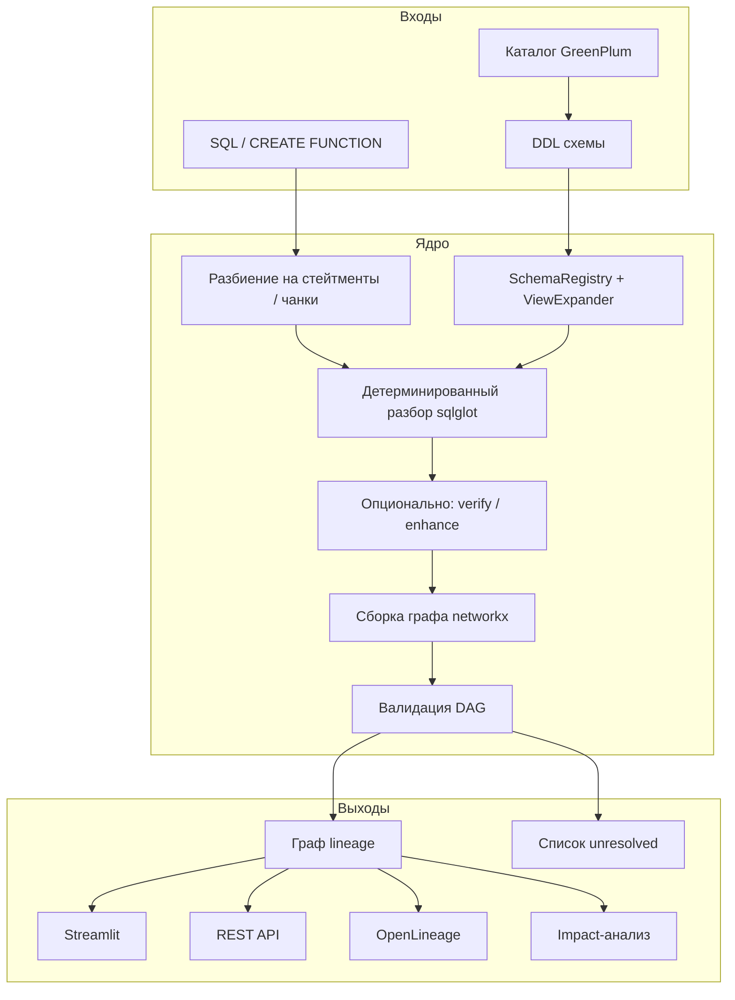

# llm4lineage

Инструмент для извлечения **data lineage** из SQL в стеке GreenPlum / PostgreSQL: от таблиц и колонок до тел PL/pgSQL-процедур. На вход — запрос или дамп DDL, на выход — структурированный граф зависимостей, отчёт о неразрешимых местах, impact-анализ и (по желанию) события OpenLineage.

Лицензия: **MIT**. Python ≥ 3.10.

---

## Зачем это нужно

В банковском и корпоративном DWH lineage обычно ломается в трёх местах:

1. **Неполное извлечение** — парсер не видит зависимости через CTE, UNION, временные таблицы внутри процедур, `SELECT *` без схемы.
2. **Нестабильный формат** — разные стили SQL дают разный JSON, с которым нельзя работать downstream.
3. **Тихий вымысел** — система «догадывается» о lineage там, где SQL динамический (`EXECUTE format(...)`), и выдаёт ложную уверенность.

`llm4lineage` строится вокруг другого принципа: **сначала детерминированный разбор**, LLM — только как опциональный слой проверки и доработки. Если зависимость нельзя подтвердить кодом, она помечается как `unresolved` / `dynamic` с низкой `confidence`, а не подменяется «правдоподобным» ребром.

Практические задачи, которые закрывает проект:

- понять, **из каких таблиц и колонок** собирается витрина или INSERT;
- проследить **влияние изменения колонки** вниз по цепочке (impact);
- разобрать **тело PL/pgSQL-функции** (temp-таблицы, ветки IF/LOOP, статический EXECUTE);
- выгрузить схему из каталога GreenPlum и подставить её в разбор `SELECT *` / VIEW;
- отдать результат в UI, REST API или в OpenLineage.

---

## Как работает система

### Общая идея

Система — конвейер с несколькими входами и одним основным артефактом: **ориентированный граф** (node-link JSON), где узлы — колонки, таблицы, операторы (UNION, агрегаты, окна), а рёбра несут тип связи, `confidence` и `provenance` (откуда взялось ребро: парсер, LLM, неразрешённый динамический SQL).



### Принцип «честности»

| Ситуация | Поведение |
|----------|-----------|
| Обычный `INSERT … SELECT` / CTE / JOIN | Детерминированные рёбра, `confidence = 1.0`, `provenance = deterministic` |
| LLM подтвердил или поправил черновик | `provenance = llm` / `llm_verified`, до Reviewer — `verified = false` |
| `EXECUTE format('…%s…', v)` | Ребро `dynamic`, `confidence ≈ 0.3`, `provenance = unresolved`, в отчёте фрагмент SQL |
| Парсер не смог разобрать SQL | Ошибка в результате (`success=false` / `error` / `parse_error`), без «пустого успеха» |

### Пять шагов колоночного пайплайна (SQL2Graph)

Так работает основной путь для обычного SQL:

1. **Chunking** — SQL режется на логические куски: CTE, ветки UNION, цель INSERT.
2. **Parsing** — sqlglot строит AST, извлекает колоночный lineage, фильтры, JOIN, операторы.
3. **Verifying** *(опционально)* — LLM сверяет детерминированный черновик с исходным SQL и предлагает правки.
4. **Enhancing** *(опционально)* — LLM точечно чинит пропуски (например, неочевидные зависимости).
5. **Combining** — сборка `MultiDiGraph`, связывание алиасов CTE с физическими таблицами, проверка ацикличности, метаданные.

После LLM-шагов детерминированный lineage **накладывается поверх** (`overlay_deterministic_column_lineage`), чтобы модель не могла «затереть» то, что парсер уже уверенно нашёл.

### Что означают рёбра графа

| Тип ребра | Смысл |
|-----------|--------|
| `DERIVED_FROM` | Значение выходной колонки происходит из исходной |
| `FILTERED_BY` / `USES_COLUMN` | Колонка участвует в WHERE/HAVING |
| `JOINS_ON` | Ключ соединения |
| `GROUPED_BY` / `AGGREGATES_ON` | Группировка и вход агрегата |
| `WINDOW_OVER` | Оконная функция |
| `ROW_FLOW_IN` / `ROW_FLOW_OUT` | Поток строк через UNION / CTE |
| `VALUE_FLOW` | Преобразование выражения |

### Уровни lineage

- **Табличный** — компактно: `target` + список физических `sources` (CTE-алиасы в источники не попадают).
- **Колоночный** — полный граф «колонка → колонка» с выражениями, UNION-ветками и литералами.
- **PL/pgSQL** — тело функции режется на SQL-стейтменты (с учётом `$$…$$`, строк и комментариев); каждый стейтмент идёт в SQL2Graph; temp-таблицы связывают шаги внутри функции; ветки IF/LOOP объединяются консервативно (все ветки в графе).

### Роль LLM и агентов

LLM **не обязателен**. Базовый путь — только sqlglot. С extras `[llm]` доступны:

- verify / enhance в пайплайне;
- агенты `Resolver` → `Reviewer` → (при необходимости) эскалация человеку: кандидатные рёбра принимаются только если Reviewer находит подтверждение в исходном SQL;
- `DocAgent` — метки PII / владелец / описание колонки из текста документации.

Кэш LLM (`LLMCache`) хранит результаты в SQLite и может обновлять запись только если новый прогон «качественнее» (`replace_cache_if_better`).

### Схема и каталог

Без DDL `SELECT *` и VIEW дают неполный lineage. Источники схемы:

- текст DDL в UI / `SchemaRegistry.load_ddl`;
- выгрузка из GreenPlum (`GPCatalogExtractor`, только чтение) → файлы, совместимые с реестром схемы; повторный запуск инкрементален по хешам определений.

---

## Возможности и ограничения

**Умеет (детерминированно, диалект postgres / GreenPlum):**

- `INSERT … SELECT`, CTE, `UNION ALL`, JOIN, фильтры, GROUP BY;
- конструкции **CREATE**:
  - `CREATE TABLE … AS SELECT` (CTAS) — колоночный и табличный lineage;
  - `CREATE [OR REPLACE] VIEW … AS SELECT` и `CREATE MATERIALIZED VIEW … AS SELECT`;
  - `CREATE TABLE (…)` — регистрация в схеме (колоночный граф пустой, target = имя таблицы);
  - в веб-UI / пайплайне DDL из загруженного скрипта подхватывается в SchemaRegistry автоматически;
- операторные узлы: union, aggregate, window, transformation, rowset;
- раскрытие `SELECT *` и VIEW при наличии схемы;
- тела PL/pgSQL (`parse_plpgsql=True`): temp-таблицы, IF/LOOP, статический `EXECUTE '…'`;
- MERGE / UPDATE на табличном уровне;
- multi-statement в веб-UI (выбор целевой таблицы, в т.ч. VIEW / CTAS).

**Ограничения:**

- UDF — lineage только по входным колонкам; table-valued UDF не поддерживаются;
- `json_extract`, `UNNEST`, структуры — best-effort;
- динамический `EXECUTE format(...)` — только как unresolved, без угадывания;
- CLI по умолчанию берёт первый стейтмент скрипта (в UI — выбор target).

---

## Установка

```bash
uv venv
source .venv/bin/activate

# полный набор для разработки
uv sync --extra llm --extra web --extra gp --extra dev
# или: uv pip install -e ".[llm,web,gp,dev]"

# только ядро (без LangChain) — mock-LLM и sqlglot
uv pip install -e .
```

| Extra | Зачем |
|-------|--------|
| *(ядро)* | Парсинг, граф, схема, PL/pgSQL-сплиттер, mock LLM |
| `[llm]` | Hugging Face / LangChain для verify, enhance, агентов |
| `[web]` | Streamlit UI + FastAPI |
| `[gp]` | `psycopg2` для выгрузки каталога GreenPlum |
| `[dev]` | pytest, coverage, ruff, mypy |

Конфигурация (`.env` по образцу `.env.example`):

```env
HF_TOKEN=your_token_here
MODEL_NAME=Qwen/Qwen3-Coder-30B-A3B-Instruct
PROVIDER=scaleway
SQL_DIALECT=postgres
# GP_DSN=postgresql://readonly@gp-host:5432/dwh
```

---

## Быстрый старт

### Колоночный lineage (без LLM)

```python
from Classes.sql2graph import SQL2GraphParser, SQL2GraphPipeline

sql = open("data/DDLs_10.txt", encoding="utf-8").read().split(";")[0]
pipeline = SQL2GraphPipeline(parser=SQL2GraphParser(dialect="postgres"))
out = pipeline.run(sql, dialect="postgres", use_llm_verify=False, use_llm_enhance=False)

print(out["pipeline_stage"])       # deterministic
print(len(out["graph"]["nodes"]))
```

Импорт `from Classes.sql2graph_classes import …` тоже работает (совместимость).

### С проверкой LLM

```python
import os
from Classes.sql2graph import SQL2GraphLLMExtractor, SQL2GraphParser, SQL2GraphPipeline
from Classes.schema_registry import SchemaRegistry

registry = SchemaRegistry(dialect="postgres").load_ddl("""
    CREATE TABLE public.orders (customer_id INT, amount NUMERIC);
""")
pipeline = SQL2GraphPipeline(
    parser=SQL2GraphParser(dialect="postgres", schema_registry=registry),
    llm_extractor=SQL2GraphLLMExtractor(hf_token=os.environ["HF_TOKEN"]),
)
out = pipeline.run(sql, dialect="postgres", use_llm_verify=True, use_llm_enhance=True)
```

### Табличный lineage

```python
from Classes.table_lineage import extract_table_lineage

result = extract_table_lineage(
    "INSERT INTO analytics.sales SELECT amount FROM orders",
    dialect="postgres",
)
print(result["target"], result["sources"])  # analytics.sales, ['orders']
```

### PL/pgSQL

```python
from Classes.sql2graph import SQL2GraphParser, SQL2GraphPipeline

pipeline = SQL2GraphPipeline(parser=SQL2GraphParser(dialect="postgres"))
out = pipeline.run(create_function_sql, dialect="postgres", parse_plpgsql=True)
# out["graph"], out.get("unresolved")
```

### Impact

```bash
llm4lineage-impact --sql data/DDLs_10.txt --target output.attr_name --direction both
```

### OpenLineage

```bash
llm4lineage-openlineage --sql query.sql --format lifecycle --namespace greenplum
```

`lifecycle` пишет START и COMPLETE с одним `runId`; в COMPLETE имена датасетов — реальные таблицы из table-lineage.

### Каталог GreenPlum

```bash
uv pip install -e ".[gp]"
export GP_DSN=postgresql://readonly@gp-host:5432/dwh
llm4lineage-gp-catalog --out data/gp_dump/
```

### REST API

```bash
uv pip install -e ".[web]"
uvicorn Web.api.main:app --reload
```

| Метод | Назначение |
|-------|------------|
| `GET /impact/{object}/{column}` | Upstream / downstream цепочка |
| `GET /lineage/{object}?format=json\|dot\|mermaid` | Граф объекта |
| `GET /coverage` | Доля verified / unresolved рёбер |
| `GET /pii` | Колонки с меткой PII |

### Разбор на логические чанки

```python
from Classes.sql_chunk_classes import SQLLogicalChunkParser

out = SQLLogicalChunkParser().preparse(sql)
# out["chunks"], out["links"] — CTE / query / target и связи JOIN/UNION/INSERT
```

---

## Веб-интерфейс (Streamlit)

```bash
uv pip install -e ".[web,llm]"
streamlit run Web/app.py
```

Интерфейс собран из модулей `Web/components/` и `Web/services/`; `Web/app.py` — тонкая сборка.

**Боковая панель:** токен HF, модель и провайдер, проверка связи с моделью, диалект, DDL схемы, флаги LLM verify/enhance, кэш LLM, разбор тел PL/pgSQL.

**Ввод SQL:** вкладки «файл» / «вставка», загрузка примеров из `data/DDLs_10.txt`, выбор целевой таблицы для multi-statement скрипта.

**Результат:**

1. Прогресс пяти шагов пайплайна.
2. Переключатель **Таблица / Колонка**.
3. Сводка (stage, target, число колонок), статус кэша.
4. При совпадении с golden-фикстурой — метрики Edge F1.
5. Список unresolved для динамического SQL в процедурах.
6. Diff изменений LLM (если verify/enhance включены).

Удобный проверочный пример — первое выражение из `data/DDLs_10.txt` (GreenPlum INSERT с CTE и `UNION ALL`).

---

## Формат результата (кратко)

**Табличный уровень:**

```json
{
  "target": "analytics.sales_summary",
  "sources": ["products.raw_data", "sales.transactions"]
}
```

**Колоночный граф (фрагмент):**

```json
{
  "nodes": [
    {"id": "orders.amount", "node_type": "source_column"},
    {"id": "output.total", "node_type": "output_column"}
  ],
  "links": [
    {
      "source": "orders.amount",
      "target": "output.total",
      "edge_type": "DERIVED_FROM",
      "confidence": 1.0,
      "provenance": "deterministic"
    }
  ]
}
```

`provenance`: `deterministic` · `llm` · `llm_verified` · `unresolved` · `regex`.

---

## Структура репозитория

```text
Classes/
  pipeline/             # парсер AST, lineage, фабрика LLM, оркестратор
  sql2graph/            # колоночный пайплайн (parser, builder, validator, …)
  sql2graph_classes.py  # тонкий re-export для старых импортов
  plpgsql_splitter.py   # разбиение тел функций
  plpgsql_lineage.py    # lineage по PL/pgSQL
  gp_catalog.py         # выгрузка каталога GP
  agents/               # Resolver / Reviewer / Doc / Orchestrator
  schema_registry.py    # реестр DDL / колонок
  table_lineage.py      # табличный lineage
  impact_analyzer.py
  openlineage_exporter.py
  llm_cache.py
Web/
  app.py                # Streamlit
  components/           # UI-блоки
  services/             # запуск пайплайна, кэш
  api/                  # FastAPI
dags/
  lineage_daily.py      # ежедневный extract → parse → publish (Airflow не обязателен)
tests/
  golden/               # эталонные графы + проверка дрейфа
data/
  DDLs_10.txt           # пример корпуса INSERT
```

---

## Тесты и CI

```bash
uv sync --extra llm --extra web --extra gp --extra dev
uv run pytest tests/ -q --cov=Classes --cov-fail-under=80
uv run ruff check .
uv run mypy
```

Golden-регрессия (точный граф первого запроса из `DDLs_10`):

```bash
python tests/golden/update_golden.py           # пересоздать эталон осознанно
python tests/golden/update_golden.py --check   # упасть при расхождении
```

CI на GitHub Actions: Python 3.10–3.13, `uv` с зафиксированным lockfile, отдельно lint (ruff + mypy) и тесты с порогом coverage 80%.

---

## Типичные проблемы

| Симптом | Что проверить |
|---------|----------------|
| 401 от Hugging Face | Токен, доступ к модели, провайдер |
| Нет модуля langchain_* | `uv pip install -e ".[llm]"` |
| `PsycopgNotInstalledError` | `uv pip install -e ".[gp]"` |
| Пустой lineage для `SELECT *` | Передать DDL схемы (UI или `SchemaRegistry`) |
| Пустой граф по функции | Включить «Parse PL/pgSQL»; смотреть список unresolved |
| LLM «model busy» / 503 | Есть retry; можно выключить enhance или взять из кэша |
| Падение golden в CI | Локально `--check`; граф должен быть стабилен к `PYTHONHASHSEED` |

---

## Что дальше

Уже сделано: колоночный и табличный lineage, PL/pgSQL, каталог GP, UI и REST API, OpenLineage lifecycle, агенты по unresolved, жёсткий CI.

Имеет смысл развивать дальше:

- постоянное хранилище рёбер вместо in-memory store в API;
- более полное expression IR для сложных выражений;
- автоподтягивание схемы из каталога в онлайн-режиме;
- проверка эквивалентности SQL после нормализации.
